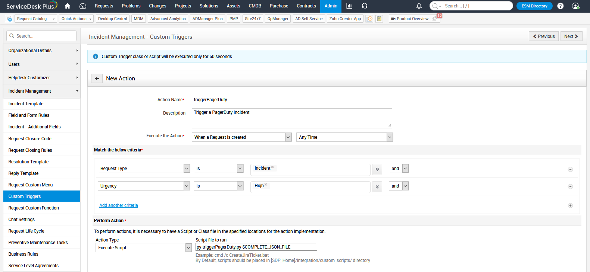
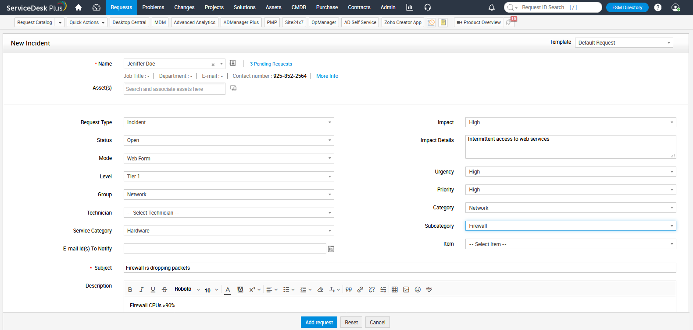
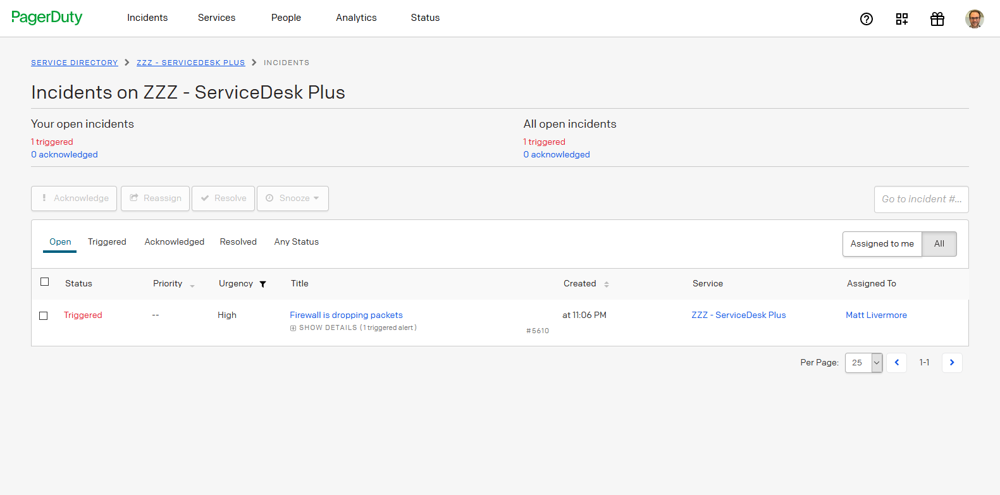

# PD-SDP-V2

This repository contains a Python script (triggerPagerDuty.py) that can be used with the on-premise server version of ManageEngine's ServiceDesk Plus to send a JSON-formatted alert payload to a PagerDuty Events v2 API endpoint.  This can either be a service-level endpoint or an endpoint associated with a Ruleset.

To create the necessary Events API routing key please consult the following PagerDuty documentation:

* [PagerDuty Rulesets](https://support.pagerduty.com/docs/rulesets#send-events-to-a-global-ruleset)
* [PagerDuty Services and Integrations](https://support.pagerduty.com/docs/services-and-integrations#create-a-generic-events-api-integration)

## Test Environment

This Python script has been tested with the following configuration:
* Windows Server 2016 Standard
* Python 3.8.5
* ServiceDesk Plus v11.1.0 Build 11129

Make sure the Python interpreter is added to the %PATH% system variable.

## Installation

Copy the Python script to the following directory on the ServiceDesk Plus server:

`C:\Program Files\ManageEngine\ServiceDesk\integration\custom_scripts`

The script is designed to send events to PagerDuty that will trigger and resolve an incident.  Modify the script adding the appropriate PagerDuty integration key.  To minimize the number of scripts that need to be maintained, consider using a key associated with an event ruleset endpoint.  The `client_url` should also be modified to include the FQDN of the local instance of ServiceDesk Plus.

The script uses a subset of the available parameters supplied by the ServiceDesk Plus V1 API.  A full list of the parameters can be found in the [ServiceDesk Plus Administration Guide](https://help.servicedeskplus.com/configurations/helpdesk/writingacustomscript.html).

The script is called via a new Incident Management Custom Trigger (see Admin | Incident Management | Custom Triggers).  Add a new Action, give it a meaningful name and description.  Select when the script executes and add any desired criteria.  As a minimum the Request Type should equal `incident` and the Urgency or Severity should equal `High`.  Then set the Action Type to `Execute Script` and specify the parameters.  By default these will be:

`py triggerPagerDuty.py $COMPLETE_JSON_FILE`

To test the script, create a new Request (see Quick Actions | Create New | Incident).

You can check the progress of the script by reviewing the History tab in the Request Details form.  If the script executes successfully an incident will be created in your chosen PagerDuty service.

## Futher Optimisations Within PagerDuty

Within PagerDuty a [Ruleset](https://support.pagerduty.com/docs/rulesets) can be used to triage and route the alert from ServiceDesk Plus making sure the most appropriate on-call responder is notified and any new actionable requests.